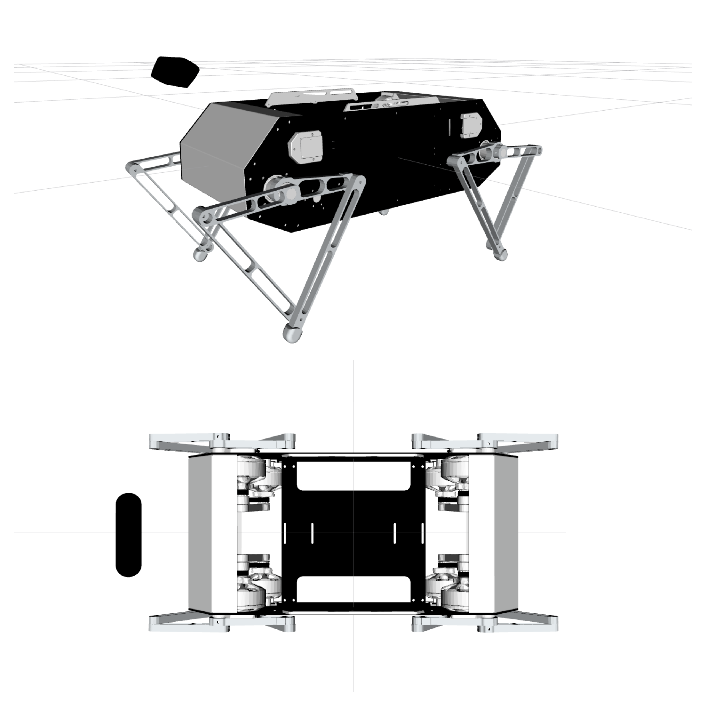

# Stanford Doggo Description

## Overview
This a a ROS package to visualize Stanford Doggo Quadruped Robot in Gazebo and Rviz

## Doggo URDF

## Dependencies
1. ROS Kinetic and above
2. ros-control
3. gazebo-ros-control

**Maintainer-** [*Raj Shinde*](https://rajpshinde.github.io/)

